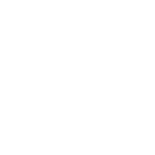
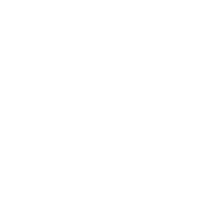
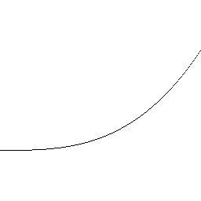
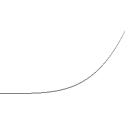
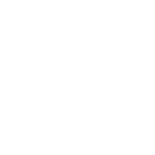
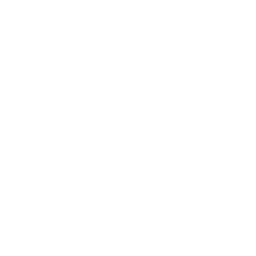
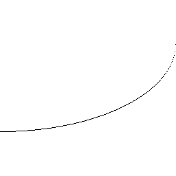
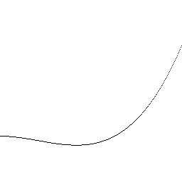
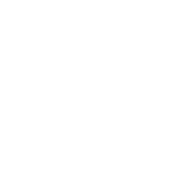
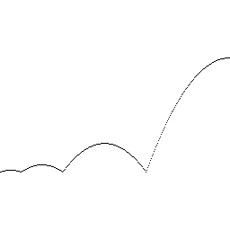

# Easing関数の実装

参考 : https://easings.net/

## 結果

### Liner

### Sin

#### Sin In

### Quad

Quad In

### Cubic

Cubic In

### Quart

Quart In

### Quint

Quint In

### Expo

Expo In

### Circ

Circ In

### Back

Back In

### Elastic

Elastic In

### Bounce

Bounce In

