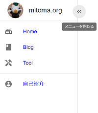
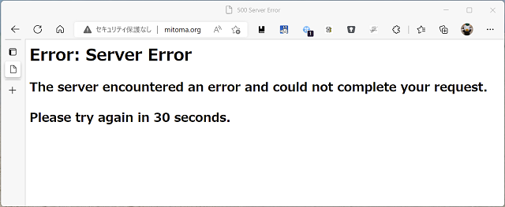

# ブログづくり

## 2022-09-03

ブログづくりは面倒になってきたし最低限の機能の実装ができて満足の気分になってきので構成だけメモって終わる。

| 大項目   | 中項目           | 選択                 |
| :------- | :--------------- | :------------------- |
| IaaS     |                  | GCP                  |
|          | 実行環境         | Cloud Run            |
|          | データベース     | なし                 |
|          | DockerRegistory  | Artifacts Registory  |
|          | IaC              | terraform            |
|          | CI/CD            | GitHub Actions       |
| backend  | 言語             | Rust                 |
|          | フレームワーク   | actix-web            |
|          | markdown parser  | pulldown-cmark       |
| frontend | 言語             | TypeScript           |
|          | フレームワーク   | React                |
|          | scaffold         | Create React App     |
|          | Router           | react-router-dom     |
|          | State Management | tanstack/react-query |
| contents | 文章             | markdown             |
|          | 図               | drawio               |

Rust で Web サービスを実装するというのを試したことが無かったのでそれが実装できたのは良かった。

Cloud Run と App Runner のどちらを選ぶかはかなり迷ったがやはり 0 インスタンスにできるというのが大きくて Cloud Run を選ぶことにした。

リソース割り当ても 1CPU 128MB で問題なさそうで、コールドスタート時も 1s 以内にレスポンスが返ってくる。

フロントエンド側は Next.js を選ぶと Cloud Run を複数台立てるか supervisord を使った素直でない Dockerimage を作る事になるので CRA をベースにして SPA にした。

SPA だと OGP をうまく設定できないなどのちょっと気になる問題はあるけど、そもそも Google 以外の SNS の OGP 対応がよろしくないと思うのであきらめた。

### 今後のメモ

- [ ] markdown のスタイルを良い感じにする
  - 今はスタイルを何も当ててないので例えばテーブルの枠線が出ない、フォントの統一感が material ui とそろっていないなどの問題がある。
  - pulldown-cmark の html.push_html そのままだとスタイルが当てられないのでデフォルトのスタイルを書くか、自分で木から HTML への変換を書く必要がありす。
- [ ] title がページごとに変わらない
  - ちゃんと対応しようと思っていたが React Helmet の更新が止まってそうだったので今度にしようという気持ちになった。
- [ ] Google Analytics の対応
  - これはやっておきたいのでやる気が出たらする

## 2022-08-08

### markdown to html content

h1 タグから blog のタイトルを抽出するようにした。

本当は markdown の上部にメタデータを埋め込んだ方がいいのかなという気もしたが、特にメタデータを使ってやりたいことが決まっているわけではないので、それほど難しいことはしないことにする。

ちなみに markdown の上部にメタデータを埋め込むことを [Front Matter][front-matter] と呼ぶらしい。

[front-matter]: https://jekyllrb.com/docs/front-matter/

### 左のメニュー

開閉ボタンを付けた。
状態をどう持つのがいいのかわからないのでとりあえず LocalStorage に入れてみた。

メニューが閉じたときに、開くボタンが思ったより場所を取るのでコンテンツを少し下に移動するようにしたけどこれはこれで微妙かな…。

## 2022-08-03

actix-web は path を受け取るときに `../` 的なパスは事前に正規化してくれるのでディレクトリトラバーサルについては特に心配する必要はなかった。

画像のパスの変換もそれなりにスッとかけた。

## 2022-08-01

mitoma.org を heroku に乗せるべく作り直している。

今はドメインにアクセスしてもこんなに悲しい画面が出てしまっている。

なのでエンジニアあるあるとしてブログづくりにいそしんでいる。

ディレクトリトラバーサル対応をまだきちんと実装していない。

画像のパスをいい感じに変換する必要が出てきてしまった。手元では相対パスで書きつつ出力時にいい感じに変換してやりたいところだが。
