# Easing関数の実装

参考 : https://easings.net/

## 結果

| Type | In | Out | InOut |
| ---- | ---- | ---- | ---- |
| liner | 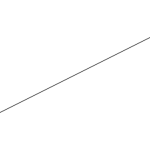 | - | - |
| sin | 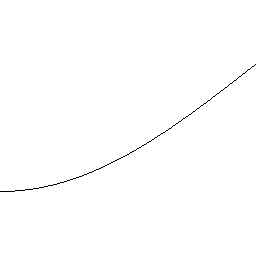 | 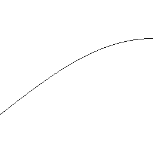 | 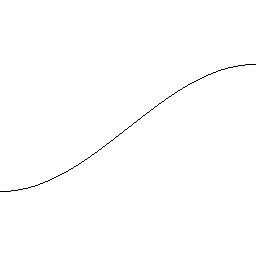 |
| quad | 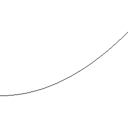 |  | 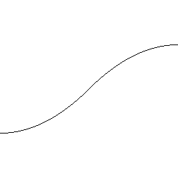 |
| cubic | 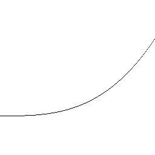 | 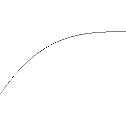 |  |
| quart | 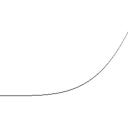 | 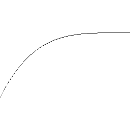 |  |
| quint | 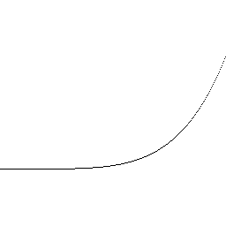 | 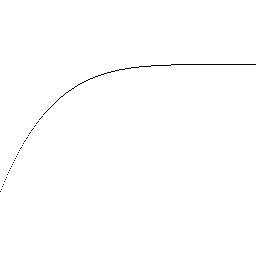 | 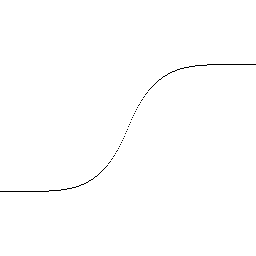 |
| expo | 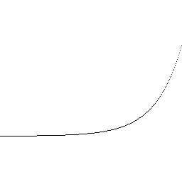 | 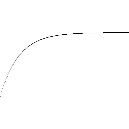 |  |
| circ | 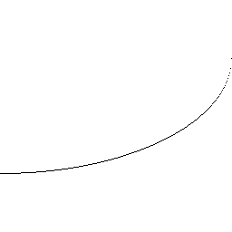 | 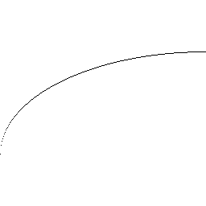 |  |
| back | 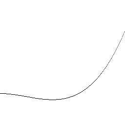 | 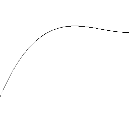 | 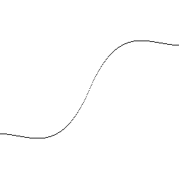 |
| elastic | 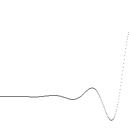 | 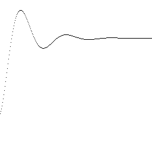 | 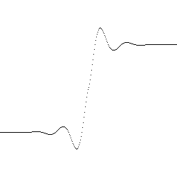 |
| bounce | 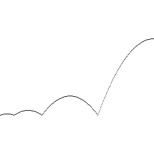 | 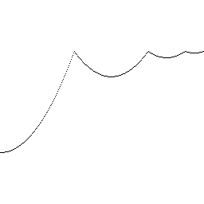 |  |
